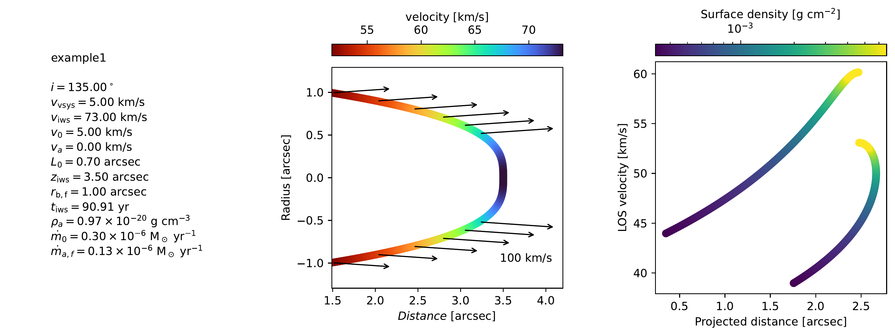
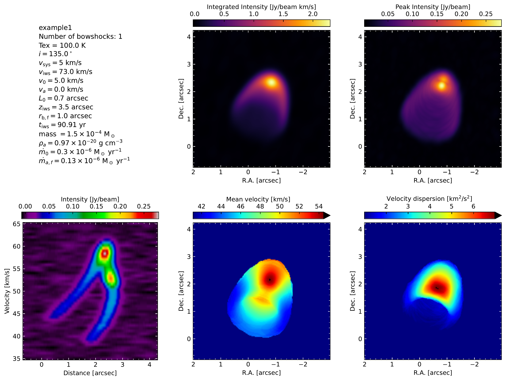

Output files
================

``bowshockpy`` generates the spectral cubes specified in *outcubes* :doc:`parameter <inputparams>`. When ``bowshockpy`` is run, it will create the path ``models/<modelname>`` if it does not exist, and the cubes will be saved in fits format within ``models/<modelname>/fits``. If specified in *outcubes*, ``bowshockpy`` will also compute the moments and position-velocity diagram from the spectral cube.

Fits files
----------

The filenames of the fits are abbreviations of the quantities and the operations performed to it. These are the abbrevations for the quantities:

.. list-table:: Quantities of the output fits files
   :widths: 10 10 10
   :header-rows: 1

   * - Quantity
     - Abbreviation
     - Unit
   * - Mass
     - m
     - solar mass
   * - Intensity
     - I
     - Jy/beam
   * - Intensity optically thin approx.
     - Ithin
     - Jy/beam
   * - CO column density
     - NCO
     - cm-2
   * - Opacities
     - tau
     - 

The abbreviations for the operations are:

.. list-table:: Operations performed to the fits files
   :widths: 10 10
   :header-rows: 1

   * - Operation
     - Abbreviation
   * - add_source
     - s
   * - rotate
     - r
   * - add_noise
     - n
   * - convolve
     - c

2D plots of the bowshock model
------------------------------

Plot of the moments and position velocity diagrams
--------------------------------------------------

