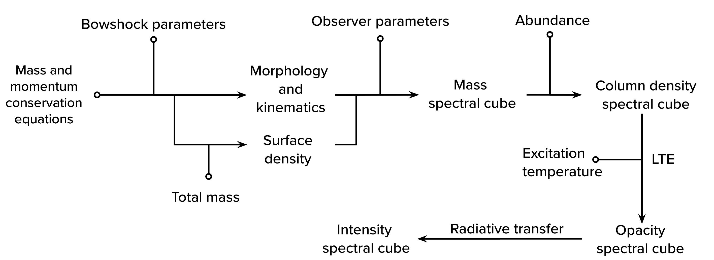

Background
====================

The bowshock model
------------------

``bowshockpy`` computes synthetic spectral cubes, PV diagrams, and moment images for a simple analytical jet-driven bowshock model, using the prescription for protostellar jets presented in `Ostriker et al. (2001) <https://ui.adsabs.harvard.edu/abs/2001ApJ...557..443O/abstract>`_ and `Tabone et al. (2018) <https://ui.adsabs.harvard.edu/abs/2018A%26A...614A.119T/abstract>`_. In this scenario, velocity variations within the beam of a highly collimated and highly supersonic jet induces the formation of internal working surfaces, from which jet material is ejected sideways. This jet material interacts with the ambient material, forming the bowshock shell. The analytical prescription implemented in ``bowshockpy`` assumes mass and momentum conservation (negligible preasure gradients), full mixing between the jet and ambient material, and a negligible size of the internal working suface.

.. 
   Although the model was focused on bowshocks from protostellar jets, we note that it could also work for jets associated to proto-planetary nebulae.

Workflow
--------

    Workflow diagram of bowshockpy for computation of the bowshock model spectral cubes.

Below, we present a brief description of the workflow of ``bowshockpy``. The name of the model parameters, as defined in :doc:`input parameters<inputparams>`, appear in parenthesis:

* From the mass and momentum conservation equations, the morphology and kinematics of the bowshock shell can be obtained as a function of a few free parameters (see `Ostriker et al. (2001) <https://ui.adsabs.harvard.edu/abs/2001ApJ...557..443O/abstract>`_ and  `Tabone et al. (2018) <https://ui.adsabs.harvard.edu/abs/2018A%26A...614A.119T/abstract>`_). These model parameters are characteristic length scale (L0), the distance between the working surface and the source (zj), the velocity of the internal working surfce (vj), velocity of the material surrounding jet (va), and the velocity at which the material is ejected from the internal working surface (v0).

* Given the total mass of the bowshock shell (mass), one can obtain its surface density. At this stage, we have all the parameters that define the model in its own reference frame. The rest of the workflow depends on the observer reference frame.

* In order to perform the mock observations, some parameters dependent of the observer reference frame are used, mainly: the inclination angle of the bowshock axis with respect to the line-of-sight (i), the observer distance to the source (distpc), the systemic velocity (vsys), and the position angle of the bowshock axis (PA). Together with some parameters defining the properties of the spectral cube, as the pixel size and channel width, ``bowshockpy`` computes, in projection, the mass of the bowshock shell at each pixel and velocity channel of the spectral cube. 

* ``bowshockpy`` can also calculate the intensities of low-J rotational CO transtions. Assuming a CO abundance (abund), ``bowshockpy`` calculates first the column densities at each pixel and channel of the spectral cube. Given the excitation temperature (Tex) and assuming Local Thermodinamic Equilibrium, the opacities are computed. Finally, ``bowshockpy`` performs the radiative transfer in order to compute the intensities. 

   
References
----------

- Tabone, B., Raga, A., Cabrit, S. & Pineau des Forêts, G. "Interaction between a pulsating jet and a surrounding disk wind. A hydrodynamical perspective." Astron. Astrophys. 614, A119 (2018).

- Ostriker, E. C., Lee, C.-F., Stone, J. M. & Mundy, L. G. A Ballistic Bow Shock Model for Jet-driven Protostellar Outflow Shells. Astrophys. J. 557, 443–450 (2001).

.. _Tabone et al. (2018): https://ui.adsabs.harvard.edu/abs/2018A%26A...614A.119T/abstract
.. _Ostriker et al. (2001): https://ui.adsabs.harvard.edu/abs/2001ApJ...557..443O/abstract
 