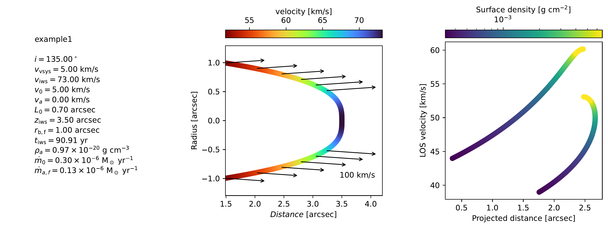
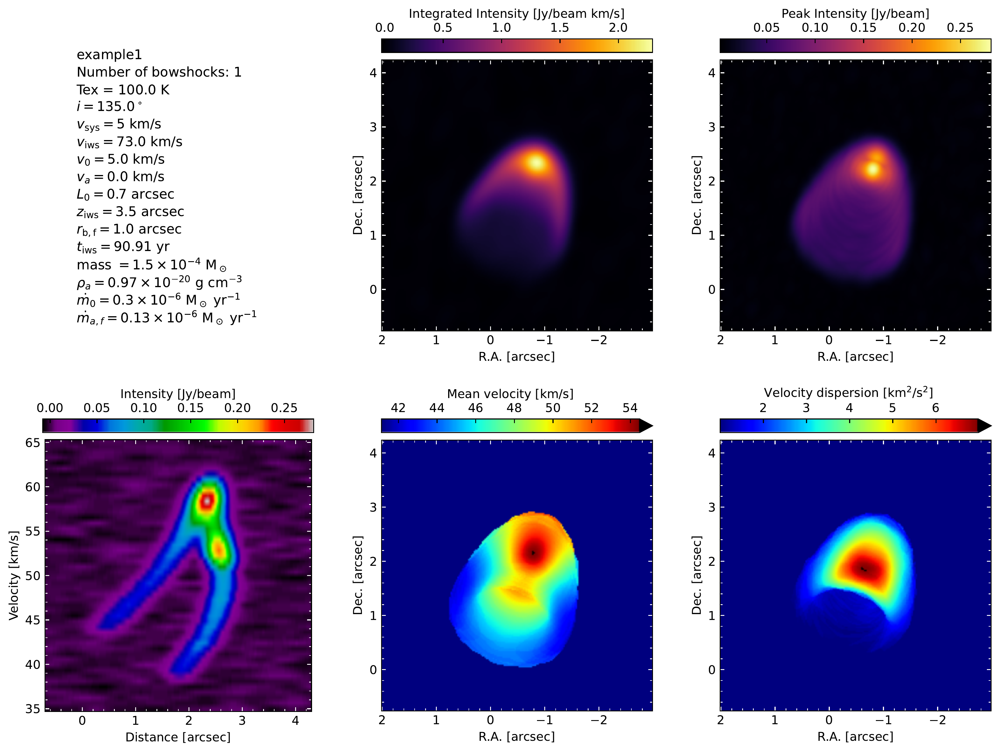

Output files
============

When ``bowshockpy`` is run from the terminal :doc:`using an input file <../examples/examples_inputfile>`, it will create the path ``models/<modelname>`` if it does not exist already. Then, it will save there several files:

- *<modelname>.py*: A copy of the input file used to generate the model.
- *bowshock_model_<n>.pdf*: A plot of the morphology and kinematics of the bowshock *n*, being *n* the index of the bowshock; i.e., if three bowshocks are included in the model, there will be three plots, one for each bowshock: *bowshock_model_1.pdf*, *bowshock_model_2.pdf*, and *bowshock_model_3.pdf*.
- *bowshock_projected_<n>.jpg*: A plot depicting the projected morphology and kinematics of the bowshock with index *n*.
- *bowshock_cube_<cubename>.pdf*: A plot with the channel maps of the spectra cube named *cubename*. 
- *momentsandpv_and_params_<cubename>.pdf*: If specified in **outcubes** parameter, ``bowshockpy`` will also compute the moments and position-velocity diagram from the spectral cubes.
- Fits files: The spectral cubes will be saved in fits format within ``models/<modelname>/fits`` folder.

The filename of each cube is an abbreviation indicating its quantity and the operations performed to it (<quantity>_<operations>.fits). The next tables shows the abbrevations used in the filename of the cubes for their quantities and the operations:

.. list-table:: Quantities of the output fits files
   :widths: 10 6 5
   :header-rows: 1

   * - Quantity
     - Abbreviation
     - Unit
   * - Mass
     - m
     - solar mass
   * - Column density (H\ :sub:`2`\ + heavier components)
     - Ntot
     - cm-2
   * - CO column density
     - NCO
     - cm-2
   * - Opacities
     - tau
     - 
   * - Intensity
     - I
     - Jy/beam
   * - Intensity optically thin approx.
     - Ithin
     - Jy/beam

.. list-table:: Operations performed to the cubes files
   :widths: 10 4
   :header-rows: 1

   * - Operation
     - Abbreviation
   * - add_source
     - s
   * - rotate
     - r
   * - add_noise
     - n
   * - convolve
     - c

For example, the cube I_nc.fits, is a cube of the intensities (I) with Gaussian noise (n) and convolved (c).

Plots of the morphology and kinematics of the bowshock
------------------------------------------------------

 (*bowshock_model_<n>.pdf*)

    Bowshock model. This figure will be generate for each bowshock included in the cube

Plots of the projected morphology and kinematics of the bowshock
----------------------------------------------------------------

*bowshock_projected_<n>.jpg*

Plots of the channel maps
-------------------------

*bowshock_cube_<cubename>.pdf*

Plot of the moments and position velocity diagrams
--------------------------------------------------

*momentsandpv_and_params_<cubename>.pdf*

    Moments and position-velocity diagram of the synthetic cube.

Fits files
----------

The cubes in fits files format will be saved in ``models/<modelname>/fits``. It can be open with ``casaviewer`` or ``ds9``.

..
  Include a screenshot of the casaviewer
