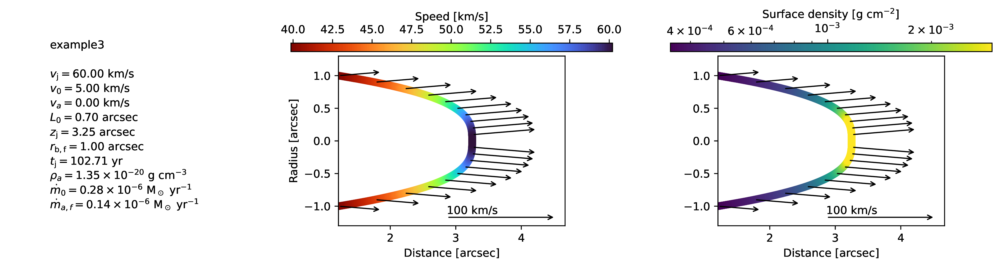
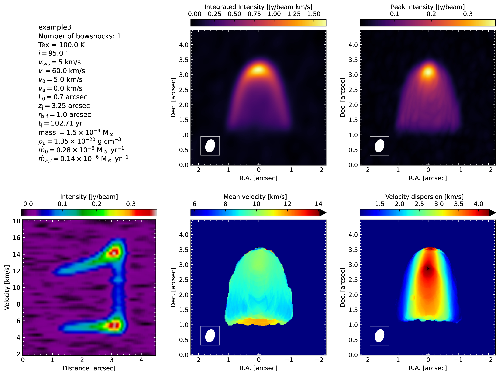
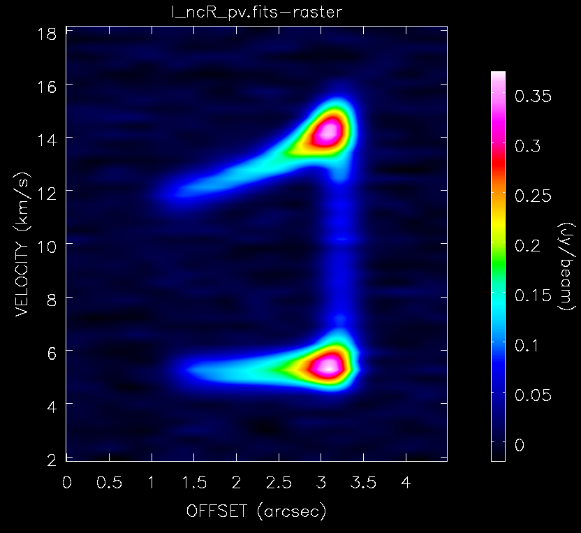

Output files
============

When ``BowshockPy`` is run from the terminal :doc:`using an input file <../examples/examples_inputfile>`, it will create the path ``models/<modelname>`` if it does not exist already. Then, it will save there several files:

- *<modelname>.py*: A copy of the input file used to generate the model.
- *bowshock_model_<n>.pdf*: A plot depicting the morphology and kinematics of the bowshock *n*, being *n* the index of the bowshock; i.e., if three bowshocks are included in the model, there will be three plots, one for each bowshock: *bowshock_model_1.pdf*, *bowshock_model_2.pdf*, and *bowshock_model_3.pdf*.
- *bowshock_projected_<n>.jpg*: A plot depicting the projected morphology and kinematics of the bowshock with index *n*.
- *bowshock_cube_<cubename>.pdf*: A plot with the channel maps of the spectra cube named *cubename*. 
- *momentsandpv_and_params_<cubename>.pdf*: If specified in **outcubes** parameter, ``BowshockPy`` will also compute the moments and position-velocity diagram from the spectral cubes.
- Fits files: The spectral cubes will be saved in fits format within ``models/<modelname>/fits`` folder.

The filename of each cube is an abbreviation of its quantity and the operations performed to it (<quantity>_<operations>.fits). The next tables shows the abbrevations used in the filename of the cubes for their quantities and the operations:

.. list-table:: Quantities of the output fits files
   :widths: 10 6 5
   :header-rows: 1

   * - Quantity
     - Abbreviation
     - Unit
   * - Mass
     - m
     - solar mass
   * - Column density (H\ :sub:`2`\ + heavier components)
     - Ntot
     - cm-2
   * - Column density emitting molecule
     - Nmol
     - cm-2
   * - Opacities
     - tau
     - 
   * - Intensity
     - I
     - Jy/beam

.. list-table:: Operations performed to the cubes files
   :widths: 10 4
   :header-rows: 1

   * - Operation
     - Abbreviation
   * - add_source
     - s
   * - rotate
     - r
   * - add_noise
     - n
   * - convolve
     - c

For example, the cube I_nc.fits, is a cube of the intensities (I) with Gaussian noise (n) and convolved (c).

Plots of the morphology and kinematics of the bowshock
------------------------------------------------------

For each bowshock, a plot named *bowshock_model_<n>.pdf* will be generated with the morphology and kinematics of the bowshock model. At the left, the input parameters of the bowshock are shown: v_j is the velocity of the internal working surface, v_0 is the velocity at which the jet material is ejected sideways from the internal working surface, va is the velocity of the ambient, L_0 is the characteristic scale, z_j is the position of the internal working surface from the origin, r_b,f is the final radius of the bowshock, and m is the mass of the bowshock shell. In addition, four parameters has been derived: t_j is the dynamical time of the bowshock, rho_a is the ambient density, mdot_0 is the rate of jet material ejected sideways from the internal working surface, and mdot_a,f is the rate of ambient material incorporated into the bowshock shell. 

    Bowshock model. This figure will be generate for each bowshock included in the cube.

Plots of the projected morphology and kinematics of the bowshock
----------------------------------------------------------------

For each bowshock, a plot named *bowshock_projected_<n>.jpg* will be generated showing the projected morphology and kinematics of the bowshock shell. On the upper left panel, the input parameters are listed, where i is the inclination angle of the bowshock symmetry axis with the line-of-sight and vsys is the systemic velocity of the source.

    Projection of bowshock model. This figure will be generate for each bowshock included in the cube.

Plots of the channel maps
-------------------------

A plot with a selection of channel maps, named *bowshock_cube_<cubename>.pdf*, will be generated. 

    Channel maps of the bowshock model.

Plot of the moments and position velocity diagrams
--------------------------------------------------

If specified in the input parameter **outcubes** (see :doc:`input file parameters <inputparams>` section), a plot with the moments and position velocity diagram, named *momentsandpv_and_params_<cubename>.pdf*, will be generated.

    Moments and position-velocity diagram of the spectral cube.

Fits files
----------

The cubes in fits files format will be saved in ``models/<modelname>/fits``, and they can be open with ``casaviewer``, ``CARTA``, or ``ds9``.

    Channel map visualized with ``casaviewer``.

   Position-Velocity diagram visualized with ``casaviewer``.
